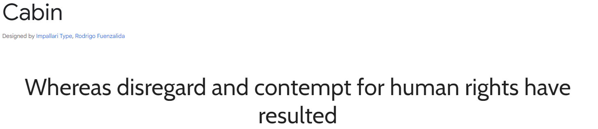
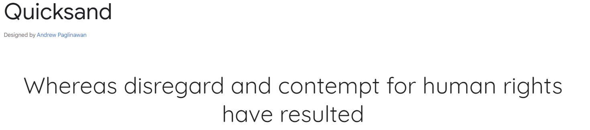
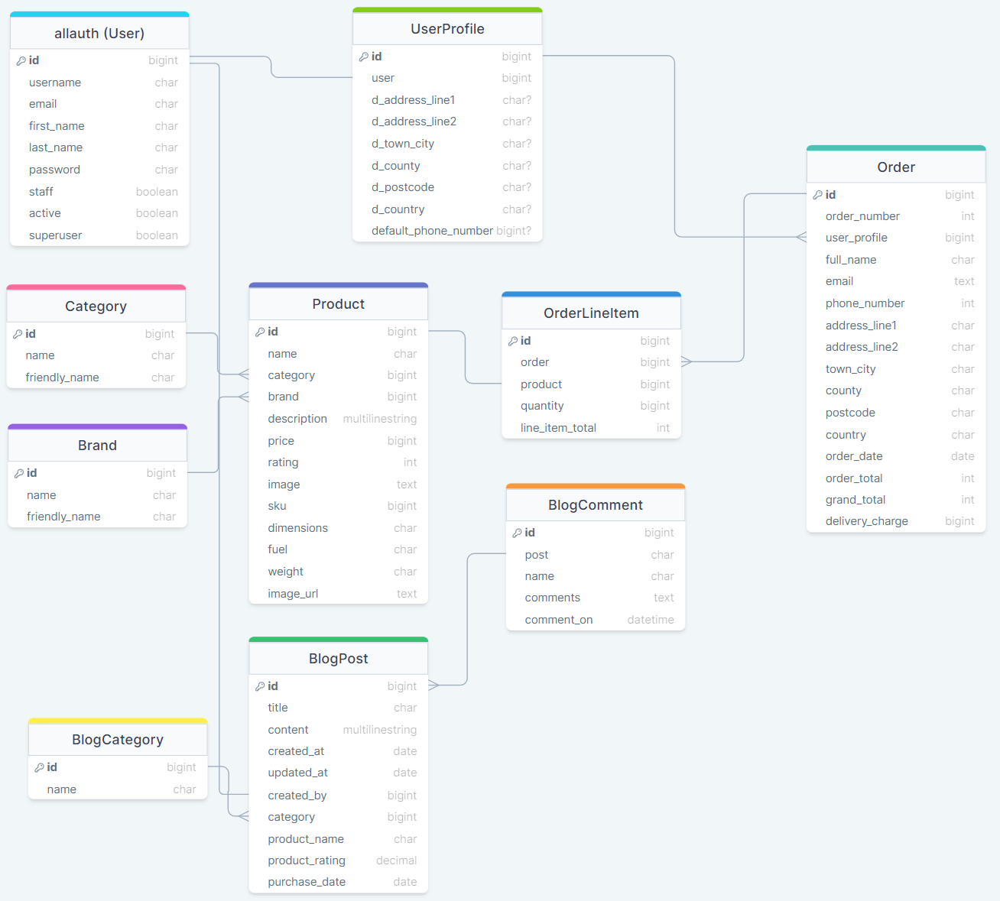

# Portfolio Project 4 - PIZZATHEACTION
## Full Stack Frameworks with Django Milestone Project

For my fourth and final project, I have undertaken the task of conceptualizing, crafting, and deploying a comprehensive Full Stack web application accompanied by a relational database, employing the Django/Python Full Stack MVC framework, and harnessing contemporary technologies. 


[Live version of the site](https://pp4-pizzatheaction-9ec0001d43af.herokuapp.com/)

---
## User Experience (UX) & Design
---

### User Stories
Based on what I wanted the project to provide, I came up with a number of user stories to focus the design and development of the site:

|User Story ID|as a/an|I want to be able to...|So that I can...|
|---|---|---|---|
|**Viewing & Navigation**|
|1|Shopper|View a list of products|Chose which to purchase|
|2|Shopper|View individual product details|Identify the price, description, valid period|
|3|Shopper|View the total of my purchases|Track how much I have spent|
|**Registration and User Accounts**|
|6|Site User|Easily register for an account|Create a personal account and view my profile|
|7|Site User|Easily login and/or logout|Access my personal account information|
|8|Site User|Easily recover my password in case I forget|Recover access to the account|
|9|Site User|Receive an email confirmation after registering|Verify that my account registration was successful|
|10|Site User|Have a personalised user profile|View my personal order history, order confirmations and save my personal and payment information|
|**Sorting and Searching**|
|11|Shopper|Sort the list of products available|Easily identify the items available by brand, price, rating|
|12|Shopper|Search for a product by name or description|Find a specific product type I would like to purchase|
|**Purchasing and Checkout**|
|16|Shopper|Easily select the quantity of an item when purchasing.|Ensure that I don't purchase the incorrect item or quantity|
|17|Shopper|View items in my shopping cart to be purchased.|View the total cost of my purchase prior to completion|
|18|Shopper|Adjust the quantity of individual items in the bag|Easily amend purchases prior to checkout.|
|19|Shopper|Easily enter my payment information|Check out quickly with no hassles.|
|20|Shopper|Feel my personal information is securely stored in the website.|Provide the required information with confidence to complete the purchase|
|21|Shopper|View and order confirmation after checkout|Verify that I haven't made any mistakes.|
|22|Shopper|Receive email confirmation that the purchase has been successful|Retain confirmation for my own personal records.|
|**Admin and Store Management**|
|23|Store Owner|Add a product|Add new items to the store.|
|24|Store Owner|Edit / Update a product|Change product prices, descriptions, images and other criteria.|
|25|Store Owner|Delete a product|Remove items that are no longer for sale.|
|**Customer Interaction**|
|26|Site User|Easily access the blog feature|View existing blog entries.|
|27|Site User|Easily create a new blog post|Add a blog post.|
|28|Site User|Leave comments on existing posts|Interact with other users around their blog posts..|

### Color Scheme


Using [Coolors](https://coolors.co/) I generated a color palette that projected the style and feel that I wanted the website to project to the user. I coupled this with the [Bootstrap](https://getbootstrap.com/docs/5.3/components/buttons/) button classes to inject some contrasting colors.

### Typography
Google Fonts was used to import the 'Cabin' and the 'Quicksand' fonts into the base.css file for use across all pages.




### Wireframes
For all wireframes please see [WIREFRAMES](WIREFRAMES.md).

### Data Design
As this is a data driven project I planned how each data set would appear in the database and connect with each other and then via the user on the front end. Using [drawSQL](https://drawsql.app/) I took the time visualise the database to help witht he construction of the applications and the website to ensure the funcationality I included was available and working correctly.



---
## Features
---

### Home Page


### Nav bar


### Footer


### Register Page


### Login Page


### Profile Page


### Sign Out Page


### Sign Out Page


### All Products Page


### Products by Brand Page


### Products by Category Page


### All Products by Rating Page


### All Products by Price Page


### View Single Product Page


### Edit Product Page


### Edit Product Page


### View Basket Page


### Checkout Page


### Checkout Success


### Blog/Community Page


### View Post Page


### Add Post Page


### Edit Post Page


### Delete Post Page


### Add Comment Page


---
## Future Features
---

Due to development time scales there were a few items I didn't include in this project, however, would consider adding into future builds. These are, but not limited to:
- 

---
## Technologies Used
---

### Languages Used
- [HTML5](https://en.wikipedia.org/wiki/HTML5)
- [CSS](https://en.wikipedia.org/wiki/Cascading_Style_Sheets)
- [JavaScript](https://en.wikipedia.org/wiki/JavaScript)
- [Python](https://en.wikipedia.org/wiki/Python_(programming_language))

### Frontend Frameworks and libraries used
- [Bootstrap]()
- [Font Awesome]()
- [JQuery]()

### Backend Frameworks, Modules and Packages used
- []()
- []()
- []()
- []()
- []()
- []()
- []()
- []()
- []()
- []()
- []()
- []()
- []()
- []()
- []()
- []()
- []()
- []()
- []()
- []()
- []()
- []()
- []()
- []()

---
## Testing
---
For all aspects of testing please see [TESTING.md](TESTING.md)

---
## Deployment

### Forking the GitHub Repository

Forking the GitHub repository allows you to create a duplicate repository in order to make changes without affecting the original.

1. Log in to GitHub and go to the [pp4-pizzatheaction GitHub repository](https://github.com/AHendley84/pp4-pizzatheaction)
2. Click on Fork (top right) to fork the repository
3. Give the fork a name and description if you wish and click "Create Fork"
4. You can now open the repository in your IDE of choice e.g. GitPod
5. Once in your IDE you can install the project requirements from the requirements.txt file using the command `pip3 install -r requirements.txt`

---

### Making a Local Clone

A local clone allows you to create a copy of the project to work on locally on your own computer in your code editor of choice (e.g. VS Code)

1. Log in to GitHub and go to the [pp4-pizzatheaction GitHub repository](https://github.com/AHendley84/pp4-pizzatheaction)
2. Click on "Code"
3. To clone using HTTPS copy the provided link on the HTTPS tab
4. Open your own terminal for your coding environment (making sure you have Git installed)
5. Set your current directory to the location you want to store your new clone
6. Type `git clone`, followed by the copied link you copied from GitHub e.g. `git clone https://github.com/AHendley84/pp4-pizzatheaction.git`
7. Press Enter to create your local clone of the project
8. Set up your local development environment
9. Install the project requirements from the requirements.txt file in the project using the command `pip3 install -r requirements.txt`
10. Create your own env.py file containing all the required environment variables
11. You are now ready to start working on your own clone of the project - enjoy!


For more details and information go to GitHub's useful guide to [cloning repositories](https://docs.github.com/en/repositories/creating-and-managing-repositories/cloning-a-repository#cloning-a-repository-to-github-desktop)

---

### Deploying Your App

Deployment allows you to transfer your project from your local environment or IDE to hosting it publicly for other people to view and enjoy. There are certain steps you will need to take to do this and they are detailed below. **These instructions are based on using an IDE like GitPod and having followed the instructions for Forking the repository above, especially installing the requirements.** For users wishing to deploy from a local clone different steps may be required which will depend on your local development environment.

#### Setting up a Database

When working on the app in GitPod a local database (sqlite) is used which will not be available on the deployed app. You will need to set up a separate database for the deployed site.

1. Go to [ElephantSQL](https://www.elephantsql.com/) and click on 'get a managed database'
2. Select 'Tiny Turtle'
3. Sign in using your GitHub account & authorise ElephantSQL to access your GitHub account
4. Set up a team and go through the login credential process or log in if you already have an account
5. Once you are logged in name your plan (usually the project name)
6. Select your nearest region
7. If you're happy click on 'create instance'
8. Go to your dashboard (click on the ElephantSQL logo) and click on the instance name
9. Copy the database URL... you will need this for the next steps

---

#### Set up Heroku & connecting your new Database


1. Go to [Heroku](https://www.heroku.com/) and log in (or set up an account if you don't have one - please note you may incur charges for using Heroku)
2. Click on the 'New' button then 'create new app'
3. Name your app and select your nearest region
4. With your app set up go to the app's settings tab and under config variable click on 'reveal config variables' and add a new variable with the Key of `DATABASE_URL` and the value as the database URL that you copied from ElephantSQL
5. Back in GitPod go to settings.py and paste the following in to your DATABASE section to tell it to connect to the new database **Note - do not push your code to GitHub whilst this value is in your settings.py, it is a secret value that must not be shared, we will remove it later**

```
DATABASES = {
        'default': dj_database_url.parse(os.environ.get('your elephanySQL database url here'))
    }
```

6. In you GitPod terminal type `python3 manage.py showmigrations` to check you are connected to the new database, if you are you will see a list of migrations with no ticks next to them
7. Run the following command `python3 manage.py migrate` to migrate the database structure from your project to the new database
8. Any data that you have added to your SQLite database will not transfer to the new one. You will need to populate the site on the deployed app once it is up and running or using Fixtures (JSON files with all your database content) if you have them. You can find out more about Fixtures and how to use them in the [Django documentation.](https://docs.djangoproject.com/en/4.2/howto/initial-data/#:~:text=you%20use%20TransactionTestCase.-,fixtures%20.,the%20manage.py%20dumpdata%20command.)
9. Create a superuser for your deployed site and new database (this will allow you to check if the database is working and access the site admin on the deployed site) using the following command in the terminal: `python3 manage.py createsuperuser` and set up login details for them following the instructions.
10. Go to the ElephantSQL site, click on your database, go to the browser tab and click on 'table queries' and select 'auth_user (public)' and click on execute, you should see your newly created user.
11. You now need to remove your new database settings from settings.py and set it up to know which version of the site you are on (development or live) to know which database to use. Go back to your GitPod dashboard, click on your avatar to go your your GitPod user settings and select 'variables'
12. Add a key of DEVELOPMENT and a value of True
13. Got to your settings.py file to the DATABASES section and replace what's there with the following code (this checks to see if there is a value called DEVELOPMENT in your environment variables - ie your development environment, rather than the deployed app and sets the database accordingly.)

```
if 'DATABASE_URL' in os.environ:
    DATABASES = {
        'default': dj_database_url.parse(os.environ.get('DATABASE_URL'))
    }
else:
    DATABASES = {
        'default': {
            'ENGINE': 'django.db.backends.sqlite3',
            'NAME': os.path.join(BASE_DIR, 'db.sqlite3'),
        }
    }
```

14. Now that you have removed your ElephantSQL database url from the settings.py file it is safe to push your code to GitHub again. Your deployed database is set up and GitPod knows which one to use for which version of the site.


#### Deploying to Heroku

1. Create a Procfile in your app in the root directory with the following content `web: gunicorn pizzatheaction.wsgi:application` and a blank line at the end.
2. Log in to Heroku using the GitPod terminal using the command `Heroku login`` and enter your Heroku email and password
  - if you have 2 factor authentication set up you will need to use `Heroku login -i` followed by your email and your Heroku API key as the password which you can find in your account settings on Heroku
4. Temporarily disable Heroku from collecting static files during deployment using the command `heroku config:set DISABLE_COLLECTSTATIC=1 --app heroku-app-name`
5. Commit your changes to GitHub using `git add .`, `git commit` & `git push` in the terminal
6. Then to deploy your site to Heroku use the command `git push Heroku main`
7. Your site will now be deployed without any of the static files (CSS, JavaScript & Media files)
8. In Heroku go to your app, click on activity to check if it has finished deploying and once it has go to the settings tab
9. Scroll down to 'Domains' and copy the 'your app can be found at' URL
10. Back in GitPod go to settings.py and add your deployed site's URL to the ALLOWED_HOSTS list
11. `git add .`, `git commit` & `git push` again and then `git push Heroku main` to push your changes
12. Once the site has finished deploying you should be able to navigate to the deployed site's URL and see your site content, though it will be a little strange-looking without CSS & media files!
13. You now need to replace the Django secret key in your settings.py (if you included it there) with an environment variable to keep it safe. To do this you can use a Django secret key generator online e.g. [miniWebtool](https://miniwebtool.com/django-secret-key-generator/), copy the key it provides.
14. Go to your Heroku app's dashboard, open settings and reveal config variables and add a new variable with a key of SECRET_KEY and a value of what you just copied.
15. In GitPod, if you have used your secret key in settings.py, go back to your GitPod dashboard, click on your avatar to go your your GitPod user settings and select 'variables'
16. Add a key of SECRET_KEY and a value of a different Django secret key from your online key generator (djecrety or similar)
17. In settings.py and change the SECRET_KEY to `SECRET_KEY = os.environ.get('SECRET_KEY', '')`
18. Below it change the value of DEBUG to the following `DEBUG = 'DEVELOPMENT' in os.environ` to dynamically change whether the app is in DEBUG mode depending on whether it is the development or deployed site
19. `git add .`, `git commit` & `git push` again and then `git push Heroku main` to push your changes
20. You can also tell Heroku to automatically deploy so you don't need to push changes to both GitHub and Heroku each time - you'll find this under the Deploy tab on your Heroku app.


#### Setting Up Your Static Files on Your Deployed Site using Amazon Web Services (AWS)

There are many options for storing your static files for a deployed site, below are the instructions for using Amazon Web Services as a cloud storage provider.

1. Create an AWS account [here](https://aws.amazon.com/) (Select a personal account for the account type). You will need to fill in your information and card details to set up an account
2. Once your account is set up and you're signed in search for s3 in the search bar
3. Click on 'create bucket' and name it to match your Heroku app, selecting your closest region and uncheck 'block all public access' then click on create bucket to set it up
4. Click on your new bucket name and go to the properties tab
5. Scroll to the bottom and click on the edit button by 'Static Website Hosting' and select 'enable', giving default values for the index and error documents (index.html & error.html) then click save changes.
6. Go to the permissions tab and copy the ARN value at the top.
7. Scroll down to the bucket policy section, select 'edit' and 'policy generator'
8. Select 'S3 bucket policy' from the dropdown
9. In principles put a * to allow all
10. Set the action to 'Get Object'
11. Paste the earlier ARN value in the ARN input
12. Click on 'add statement' then 'generate policy'
13. Copy the policy text that the generator creates
14. Back in your bucket settings (should still be open in another tab) paste the text in to the Bucket Policy empty text area then add a '/*' to the end of the resource value (which should have your bucket name in it) this will allow access to all the resources in the bucket and click save
15. Scroll down to the access control list and grant Read and Write access to Everyone (public access) by checking the boxes
16. Scroll down to the Cross-Origin Resource Sharing (CORS) section and paste in the following and save:

```
[
    {
        "AllowedHeaders": [
            "Authorization"
        ],
        "AllowedMethods": [
            "GET"
        ],
        "AllowedOrigins": [
            "*"
        ],
        "ExposeHeaders": []
    }
]
```

17. Go back to your AWS dashboard by clicking on the AWS logo at the top left and type in IAM in the search bar and select the IAM service
18. Click on the user groups tab and create a new group, with the name of your choice, ideally with your app name in it and create the group
19. Go to the policies tab and create a policy, go the JSON tab and search for the S3FullAccess policy and import it
20. Edit the policy to the following:

```
{
    "Version": "2012-10-17",
    "Statement": [
        {
            "Effect": "Allow",
            "Action": "s3:*",
            "Resource": [
                "arn:aws:s3:::bucket-name",
                "arn:aws:s3:::bucket-name/*",
            ]
        }
    ]
}
```

21. Click on next and then review
22. Name the policy and give it a description and then create your policy
23. Go to the User Groups tab, select your group and go to permissions and click 'add permissions' then 'attach policy' selecting your newly created policy and clicking 'Attach policies'
24. Create a user for the group by going to the User tab and clicking 'create user'
25. Name your user (you don't need to select AWS Console access) click next and add your user to your group clicking next as required and 'create user'
26. Download and save the csv file with the user's credentials - this is important, you will not be able to access this information again
27. Back in GitPod go to your settings.py file and paste in the following code which tells the app to look for an environment variable called USE_AWS and if it's there to use the following settings to access the static files.

```
if 'USE_AWS' in os.environ:
    # Cache control
    AWS_S3_OBJECT_PARAMETERS = {
        'Expires': 'Thu, 31 Dec 2099 20:00:00 GMT',
        'CacheControl': 'max-age=94608000',
    }

    # Bucket Config
    AWS_STORAGE_BUCKET_NAME = 'pizzatheaction'
    AWS_S3_REGION_NAME = 'eu-west-2'
    AWS_ACCESS_KEY_ID = os.environ.get('AWS_ACCESS_KEY_ID')
    AWS_SECRET_ACCESS_KEY = os.environ.get('AWS_SECRET_ACCESS_KEY')
    AWS_S3_CUSTOM_DOMAIN = f'{AWS_STORAGE_BUCKET_NAME}.s3.amazonaws.com'
```
28. Set up the following config variables in Heroku using the information in the csv file that you downloaded:
  - AWS_ACCESS_KEY_ID: *your access key value*
  - AWS_SECRET_ACCESS_KEY: *your secret access key value*
  - USE_AWS: True
29. Remove COLLECTSTATIC from the config variables in Heroku
30. Back in GitPod create a file called custom_storages.py in the root directory and add the following:

```
from django.conf import settings
from storages.backends.s3boto3 import S3Boto3Storage


class StaticStorage(S3Boto3Storage):
    location = settings.STATICFILES_LOCATION


class MediaStorage(S3Boto3Storage):
    location = settings.MEDIAFILES_LOCATION

```

31. In settings.py add the following to tell it to look for the new storage classes we just created in custom_storages and to override the URLS for static and media files. Put this just below the AWS code from earlier within the if `'USE_AWS' in os.environ` statement.

```
# Static and media files
STATICFILES_STORAGE = 'custom_storages.StaticStorage'
STATICFILES_LOCATION = 'static'
DEFAULT_FILE_STORAGE = 'custom_storages.MediaStorage'
MEDIAFILES_LOCATION = 'media'

# Override static and media URLs in production
STATIC_URL = f'https://{AWS_S3_CUSTOM_DOMAIN}/{STATICFILES_LOCATION}/'
MEDIA_URL = f'https://{AWS_S3_CUSTOM_DOMAIN}/{MEDIAFILES_LOCATION}/'

```

32. Save your settings.py then push to add/commit/push to GitHub (if you've set up automatic deploys you won't need to also push to Heroku)
33. Once the deployment has finished check your S3 bucket, there should be a static folder in there with your static files (CSS / JS folders with files inside) and the live site should now have its CSS styling and any JavaScript functionality.
34. Finally to add your media files (images & video) simply go back to AWS, create a new folder called 'media' in the same place as the new 'static' folder, click on the folder and drag and drop all your media files in to the browser window.
35. Click next and under manage public permissions select 'grant public access to these objects' and click upload
35. Your site should now contain all your images, videos, styling and JavaScript! Well done!


#### Setting up Stripe Payments on your deployed site

1. Log in to Stripe, click on the developers tab and API keys copy the API key and set them in Heroku as config variables in the following:

- STRIPE_PUBLIC_KEY: Stripe publishable key goes here
- STRIPE_SECRET_KEY: Stripe secret key goes here

2. Back in Stripe set up a new webhook for your deployed site by clicking on webhooks, click on 'add endpoint' and paste in your deployed site's URL setting it to listen for all events.
3. Click on your newly set up webhook and click on 'Signing Secret' at the top to reveal the secret value. Copy it and set it as a new config variable in Heroku:
- STRIPE_WH_SECRET: Signing secret from new webhook.

---
## Credits & Acknowledgments
---